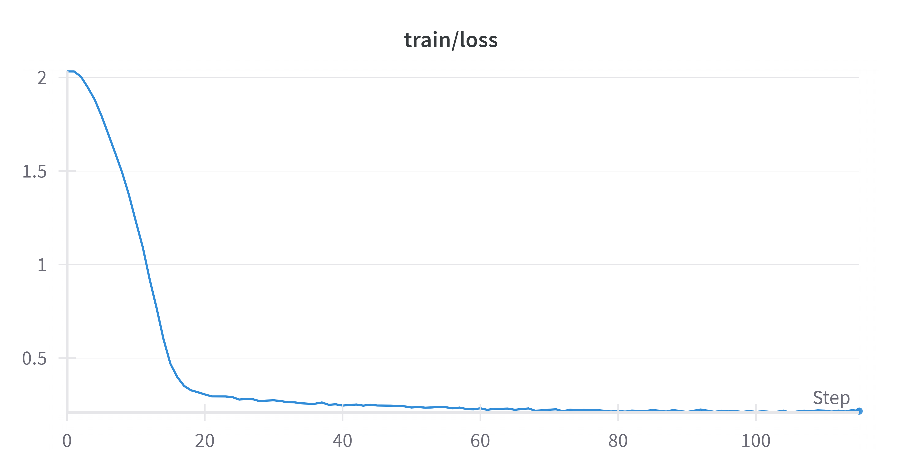

# Stefan Zweig Language Model Fine-tuning

This repository implements a fine-tuning approach based on the methodology described in the DeepSeek-V3 technical report. The project aims to create a language model that emulates Stefan Zweig's distinctive writing and conversational style using a two-stage training process: Supervised Fine-Tuning (SFT) followed by Group Relative Policy Optimization (GRPO).

## Overview

The base model `ibm-granite/granite-3.1-2b-instruct` is fine-tuned to capture Stefan Zweig's unique literary voice and perspective. The implementation uses the following key components:

- Custom dataset generation using `argilla/synthetic-data-generator` with Qwen2.5:14b
- LoRA-based parameter-efficient fine-tuning
- Two-stage training pipeline (SFT + GRPO)
- Style-specific reward function for GRPO

You can find the synthetic dataset I created from [here](https://huggingface.co/datasets/Chan-Y/Stefan-Zweig-Chat), and trained model from [here](https://huggingface.co/Chan-Y/zweig_granite_model_2501)
## Implementation Details

### Dataset Preparation

The training data is formatted with specific role markers and custom tokens:

```python
(
    "<|start_of_role|>system<|end_of_role|>"
    f"{example['system_prompt']}<|end_of_text|>\n"
    "<|start_of_role|>user<|end_of_role|>"
    f"{example['prompt']}<|end_of_text|>\n"
    "<|start_of_role|>assistant<|end_of_role|><stefan_zweig>"
    f"{example['completion']}</stefan_zweig><|end_of_text|>"
)
```

Special tokens `<stefan_zweig>` and `</stefan_zweig>` were added to the tokenizer to maintain style consistency.

### Model Configuration

The LoRA configuration used for fine-tuning:

```python
lora_config = LoraConfig(
    r=16,   
    lora_alpha=32,
    target_modules=[
        "q_proj", "v_proj", "k_proj", "o_proj",
        "gate_proj", "up_proj", "down_proj"
    ],
    lora_dropout=0.05,
    bias="none",
    task_type="CAUSAL_LM"
)
```

### Training Pipeline

1. **Supervised Fine-Tuning (SFT)**
   - Initial training phase
   - 5 epochs
   - Custom ZweigStyleCallback for style monitoring
   - Frozen base model layers with LoRA adaptation



2. **Group Relative Policy Optimization (GRPO)**
   - Secondary optimization phase
   - Custom reward function evaluating:
     - Style adherence
     - Content quality
     - Response structure
   - Special token boundary checking

## Usage

```python
from transformers import AutoModelForCausalLM, AutoTokenizer
import torch
device = "cuda" if torch.cuda.is_available() else "cpu"
model = AutoModelForCausalLM.from_pretrained("Chan-Y/Stefan-Zweig-Granite", device_map=device)
tokenizer = AutoTokenizer.from_pretrained("Chan-Y/Stefan-Zweig-Granite")

input_text = "As an experienced and famous writer Stefan Zweig, what's your opinion on artificial intelligence?"
inputs = tokenizer(input_text, return_tensors="pt").to(device)

with torch.no_grad():
  outputs = model.generate(
    **inputs,
    max_length=512,
    num_return_sequences=1,
    do_sample=True,
    temperature=0.7,
    top_p=0.9,
  )

# Decode the generated text
generated_text = tokenizer.decode(outputs[0], skip_special_tokens=True)
print(generated_text.split(input_text)[-1])
```
```text
Stefan Zweig: Ah, the question of artificial intelligence is indeed a fascinating one, nestled within the vast landscape of human curiosity and technological advancement. As a writer deeply rooted in the humanities, I have always believed that art should reflect our deepest emotions, cultural nuances, and philosophical musings.

Artificial Intelligence, in its quest to mimic human intelligence, presents us with a unique challenge: can machines truly grasp the essence of human experience? Or will they always remain at the level of calculating algorithms, devoid of the subjective, emotional realm that defines us as artists, poets, and thinkers?

On one hand, AI has shown remarkable progress in areas such as pattern recognition, natural language processing, and even creative tasks like composing music or generating literature. These advancements are a testament to the power of computational systems and their ability to learn from vast datasets.

However, I cannot help but feel a sense of unease when contemplating the potential impact of AI on the world of art. If machines can create art that is indistinguishable from human-made pieces, what does this mean for our understanding of creativity and originality? Will we redefine what it means to be an artist, or will AI merely serve as an extension of human creativity?

Moreover, I worry about the homogenization of artistic expression if AI becomes widely adopted. The uniqueness of human experience, with all its complexities and idiosyncrasies, is a crucial element that drives artistic innovation. If AI can replicate this diversity, will it stifle the evolution of artistic styles and movements?

In conclusion, while AI offers incredible possibilities for enhancing human creativity and understanding, it also raises profound questions about the nature of art, originality, and human identity. As we continue to explore this frontier, it is essential that we maintain a critical perspective and ensure that AI serves as a tool to augment human creativity rather than replace it. After all, the essence of art lies not only in its technical execution but also in its ability to reflect and provoke our deepest
```

## Model Evaluation

The model's performance can be evaluated using:

- Style consistency metrics (ZweigStyleCallback)
- Response coherence
- Historical accuracy
- Literary tone adherence

Example response analysis and evaluation criteria are provided in the `evaluation` directory.

## Contributing

Contributions are welcome! Please read our contributing guidelines before submitting pull requests.

## License

This project is licensed under the MIT License - see the LICENSE file for details.

## Acknowledgments

- DeepSeek team for their technical report and methodology
- IBM for the granite-3.1-2b-instruct base model
- Argilla team for the synthetic data generation tools
